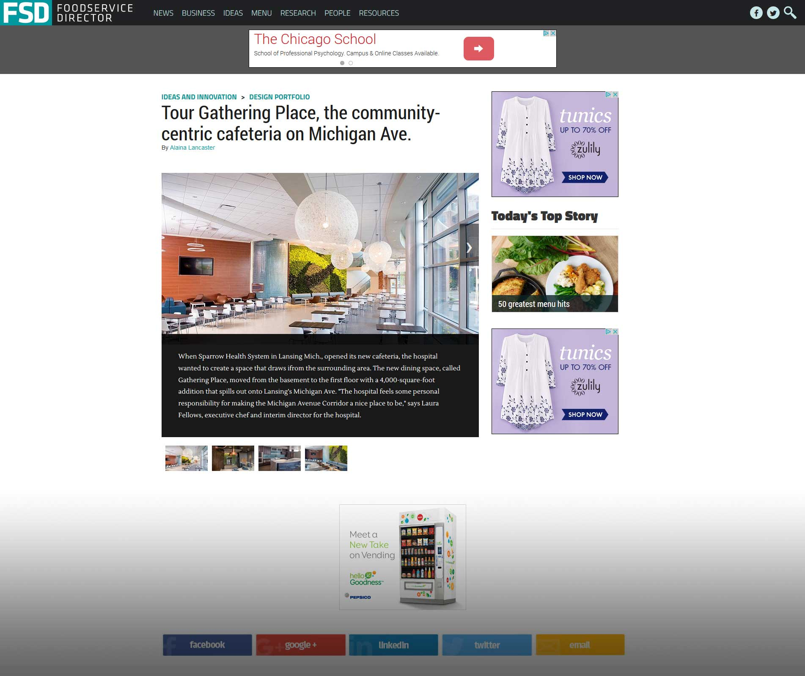

# Enhanced Slideshow Project

## Objective

Create a slideshow content type that loads via ajax, sending a new pageview to Google Analytics and also reloads advertisements on page.

## Requirements

* AJAX reload for user experience
* Single content type
* Google Analytics pageview with slide
* Ads refresh with slide transition

## Implementation

* Feature (enhanced_slideshow)
  * Content Type
  * Field Bases
  * Field Instances
  * Views
  * Display Suite View Modes
  * Display Suite Layout Settings
  * Display Suite Fields
  * Display Suite Field Settings
* enhanced_slideshow.js
  * Send GA pageview on transition
  * Reload ads on transition via ad server function call
  * Customize pager
* template.php additions
  * Include required JavaScript on nodes
* Incorporate the DX Ad Tags via expanding existing functionality to csp_ads module (originally written by third party)
  * Existing csp_ads module handled ad serving on site using legacy MJX ad tags.
  * Expanded functionality to include DX ad tags and serve them on the slideshow node type
